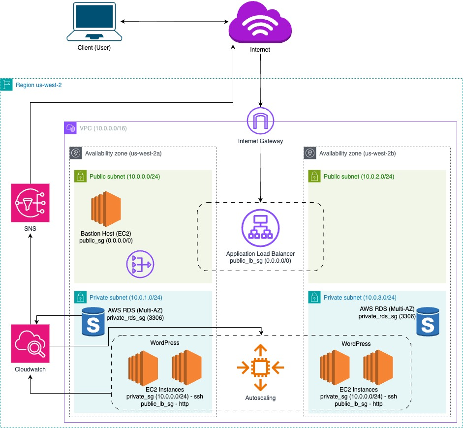

<p align="center">
  
</p>

# 🚀 Automated WordPress Deployment on AWS using Terraform

This project automates the deployment of a **highly available, secure, and scalable** WordPress environment on AWS using Terraform. It provisions essential cloud infrastructure including **VPC**, **subnets**, **EC2 instances**, **RDS**, **ALB**, **Auto Scaling**, **CloudWatch**, and **SNS**.

[](https://github.com/Adeel91/aws-wordpress-terraform)

---

## 🧱 Terraform Modules Used

### 1. **VPC Module** 🌍
- Creates a VPC with **public and private subnets** across **2 Availability Zones**.
- Configures **Internet Gateway**, **NAT Gateway**, and routing tables.

### 2. **Security Group Module** 🔐
- Defines security groups for:
  - Bastion host
  - WordPress EC2 instances
  - RDS
  - ALB

### 3. **EC2 Module** 💻
- Deploys:
  - A **Bastion Host** in a public subnet for SSH access.
  - **WordPress instances** in private subnets using launch templates and Auto Scaling groups.

### 4. **ALB Module** ⚖️
- Configures an **Application Load Balancer** to distribute incoming traffic across multiple WordPress instances.

### 5. **RDS Module** 🗄️
- Deploys a **managed MySQL database** for WordPress in private subnets.
- Enables automated backups, multi-AZ failover, and enhanced security.

### 6. **Auto Scaling Module** 📈
- Automatically adjusts the number of WordPress EC2 instances based on traffic.
- Integrated with CloudWatch alarms.

### 7. **CloudWatch Module** 📊
- Monitors EC2 instances, RDS, and ALB.
- Sets up custom metrics and alarms (e.g., CPU usage, disk space).

### 8. **SNS Module** 📬
- Sends notifications (e.g., CloudWatch alarms) via **email or SMS** using **Amazon SNS topics**.


---

## 🌍 Infrastructure Overview



This project creates and configures the following key AWS resources:

- **VPC** 🌐: A custom VPC with **public** and **private** subnets spread across two Availability Zones (AZs).
- **Internet Gateway (IGW)** 🌎: Provides internet access to resources in the VPC.
- **NAT Gateway** 🔄: Allows private instances to access the internet while keeping them secure from inbound traffic.
- **Security Groups** 🔒: Configures rules for the Bastion Host (public subnet) and WordPress instances (private subnet).
- **EC2 Instances** 💻: 
  - **Bastion Host** 🔑: A public instance for secure SSH access to private instances.
  - **WordPress Instances** 📝: Deployed in private subnets, ensuring the application is protected from direct access.

- **ALB (Application Load Balancer)** ⚖️: Balances traffic between WordPress instances for high availability and fault tolerance.

- **Autoscaling** 🦥: Scaling wordpress instances horizontally based on the load on machines.

---

## ⚙️ How It Works

### 1. **VPC and Networking** 🌍
- A **VPC** is created with both **public** and **private** subnets across **2 Availability Zones (AZs)**.
- Public subnets have internet access via an **Internet Gateway**, while private subnets use a **NAT Gateway** for secure outbound access.

### 2. **EC2 Instances** 💻
- **Bastion Host** 🔑: A secure EC2 instance in the public subnet, allowing SSH access to private instances.
- **WordPress Instances** 📝: Deployed in private subnets for added security.

### 3. **Load Balancer (ALB)** ⚖️
- An **Application Load Balancer (ALB)** is configured to route HTTP traffic to the WordPress EC2 instances, ensuring high availability and efficient traffic distribution.

---

## 📁 Project File Structure

```bash
aws-wordpress-terraform/
│
├── environments/
│   └── staging/
│       ├── main.tf
│       ├── variables.tf
│       └── outputs.tf
│
├── modules/
│   ├── vpc/
│   │   ├── main.tf
│   │   ├── outputs.tf
│   │   └── variables.tf
│   ├── ec2/
│   │   ├── main.tf
│   │   ├── outputs.tf
│   │   └── variables.tf
│   ├── alb/
│   ├── rds/
│   ├── ec2/
│   ├── asg/
│   ├── sg
│   ├── cloudwatch/
│   └── sns/
│   └── subnet/
│   └── igw/
│   └── nat/
│   └── rtb/
│
├── userdata/
│   └── bastion-setup.sh      
│   └── wordpress-setup.sh     # Bootstraps WordPress with theme/plugins
│
├── .gitignore
├── main.tf
├── outputs.tf
├── variables.tf
├── provider_aws.tf
└── README.md
```

---

## 📋 How to Use

### Prerequisites
- **Terraform 1.x** or later
- **AWS CLI** installed and configured
- An **AWS account** with the necessary permissions

### Steps to Deploy

1. **Clone the repository**:
   ```bash
   git clone https://github.com/yourusername/aws-wordpress-terraform.git
   cd aws-wordpress-terraform
   ```

2. **Update Terraform variables**:
  Modify the terraform.tfvars file with your own values

3. **Initialize Terraform**:

    Initialize Terraform on your local machine or use Terraform cloud

    ```bash
    terraform init
    ```

4. **Review the execution plan**:
  
    Review your terraform plan for deploying

    ```bash
    terraform plan
    ```

5. **Apply the configuration**:
  
    Apply your configuration using the following command

    ```bash
    terraform apply
    ```

6. **Access WordPress**:

  - Once the ALB is created, open the ALB DNS name in your browser.
  - WordPress should be ready with the Astra theme and WooCommerce plugin configured.

---

## 📦 Features

✅ Fully automated setup with infrastructure-as-code

✅ WordPress EC2 instances behind an ALB

✅ Bastion host for secure SSH access

✅ RDS (MySQL) for database storage

✅ Auto Scaling Group for dynamic scaling

✅ CloudWatch monitoring and alarms

✅ SNS alerts for system notifications

✅ Modular, reusable Terraform structure

---

## 🧪 Testing

✅ Use curl or browser to test the ALB DNS.

✅ SSH into the Bastion host and connect to private instances.

✅ Verify database access and replication (if multi-AZ RDS is enabled).

✅ Simulate load to test Auto Scaling and alarms.


---

## 🧹 Cleanup

To destroy all resources:

```bash
terraform destroy
````

---

## 🧠 Future Enhancements

✅ HTTPS via ACM + ALB

✅ S3 backend for remote Terraform state

✅ CloudFront + WAF

✅ CI/CD pipeline integration (e.g., GitHub Actions)
  